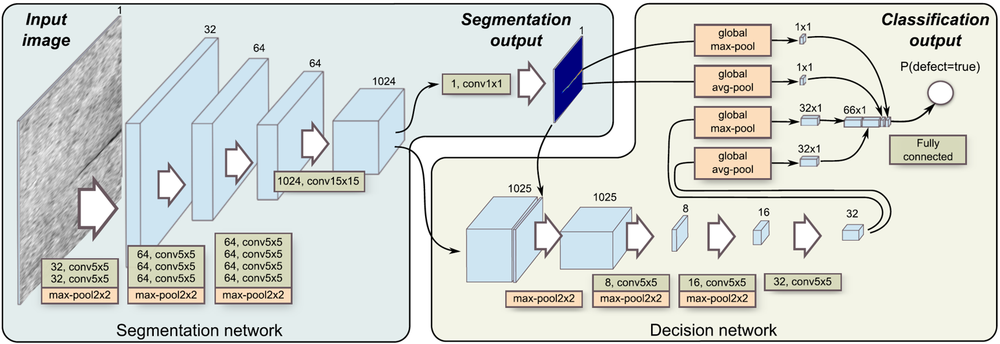

## Segmentation Based Silicon Solar Panel Defect Detection

This is a deep learning application project in the industrial field, intended to detect defects on the silicon solar panel. The code is based on keras and runs on GPU.

This is an improved version, based on the the article "**Segmentation-Based Deep-Learning Approach for Surface-Defect Detection**". The author submitted the paper to Journal of Intelligent Manufacturing (https://link.springer.com/article/10.1007/s10845-019-01476-x), where it was published In May 2019 .

### The environment

```
python 3.8.10
CUDA 11.2
tensorflow 2.9.0
keras 2.9.0
pillow 9.1.1
opencv-python 4.6.0.66
scikit-learn 1.1.2
alive_progress 2.4.0
```

### File structure

```
└──  Segmentation_Based_Silicon_Solar_Panel_Defect_Detection
    ├── dataset
    │   ├── defect
    │   │   ├── raw_img
    │   │   └── manual_mask
    │   ├── nonedefect
    │   │   ├── raw_img
    │   │   └── manual_mask
    │   ├── total
    │   │   ├── mask
    │   │   ├── png
    │   │   ├── sub_mask
    │   │   ├── sub_mask_reorder
    │   │   ├── sub_img
    │   │   └── sub_img_reorder
    │   ├── train_set
    │   │   ├── src
    │   │   ├── label
    │   │   ├── src_aug
    │   │   └── label_aug
    │   ├── val_set
    │   │   └── ...
    │   └── test_set
    │       └── ...
    ├── pre_processing
    ├── train
    ├── model
    ├── logs
    └── result
```

### Dataset

The data set provided by the teacher only contains 10 silicon images of defective and no flawed silicon. The size of each picture is 3672*5488. You can see the dataset in`` dataset/defect/raw_img`` and `` dataset/nonedefect/raw_img`` 

### Pre -processing

If you just want to use the sub pictures or the pre-processed images, you can just skip this section.

Because the dataset contains only images, there are no masks, it necessary to manually draw masks for subsequent training. You can see these in ``/dataset/.../manual_masks``. 

pre-processing on defective images and no defective images:

```
python homomorphic_defect.py
python homomorphic_nonedefect.py
```

Since the size of the picture is too large, we cut a single picture into 54 sub pictures with a size of 608*608.

```
python generating_sub.py
```

In order to better split the training set, we resort all the images

```
python resort.py
```

And then we randomly split the`` train_set, val_set and test_set``, which contains 840, 120 and 120 images.

```
python generating_train_set.py
```

### 	Training



From the composition diagram, we can see several obvious features: there are two network subjects: dividing networks and decision -making networks; two outputs: segmentation output and classification output. At the same time, it is different from general methods. This structure uses relatively large convolution kernels: 5x5 and 15X15. We improve the work by adding a series of upsampling, in order to get the same size segmentation output.

Before training, data enhancement is necessary.

```
python data_manager.py
```

Separate the two subject networks and step by step. The reason is that the network parameters are difficult to train. At the same time, the losses of the two parts of the network are hard to determine.

Here we choose the training proposal:

<table>
	<tr>
	    <td colspan="2" style="text-align:center">loss function</td>
	    <td rowspan="2" style="text-align:center">learning rate</td>
	    <td rowspan="2" style="text-align:center">max epoch</td>  
        <td rowspan="2" style="text-align:center">optimizar</td>  
	</tr >
    <tr>
	    <th style="text-align:center">segmentation</th>
	    <th style="text-align:center">decision</th>  
	</tr >
    <tr>
	    <td style="text-align:center">mse</td>
	    <td style="text-align:center">binary_crossentropy</td>
	    <td style="text-align:center">0.001</td>  
        <td style="text-align:center">20</td> 
        <td style="text-align:center">adam</td> 
	</tr >
    <tr>
	    <td style="text-align:center">binary_crossentropy</td>
	    <td style="text-align:center">binary_crossentropy</td>
	    <td style="text-align:center">0.0001</td>  
        <td style="text-align:center">20</td>
        <td style="text-align:center">adam</td> 
	</tr >
</table>

```
python train.py
```

### Tests

For ``test_set``， the result is as followed 

| test_set_aug |  TP  |  FP  |  FN  |  TN  |
| :----------: | :--: | :--: | :--: | :--: |
|     1000     | 453  |  5   |  47  | 495  |


Also, for larger images, we can use the same method: segmentation first, then merging, to obtain the results.


